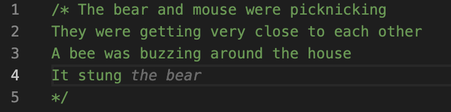

# GitHub Copilot Stories

This is a collection of stories written in JavaScript files, together with GitHub Copilot. JavaScript was chosen so that anyone can play around with the stories without needing to use a very specific interpreter or compiler.

## Rules

The first sentence can be written by a human.
Any other sentence should only give Copilot directional hints. Only a maximum of two words can be written by a human.

Use these limitations to guide Copilot to write sensible, context-driven additions to your story like the following example:



To increase your chances of CoPilot giving nice story suggestions, use common English nouns and retry formulating a sentence a couple of times.

### Why?

These stories are meant to represent that CoPilot is pretty awesome at understanding lexical context and logic. For example, take this excerpt:

```
She took a step and saw a big, big tree
It creeked and roared and roared and roared
Its age was about 100 years old
Truly, it was a very old tree
Falsely, it was a very young tree
Maybe it was a tree that was growing
Or maybe it was a tree that was dying
```

Words that identify a piece of logic, such as "truly", can make CoPilot generate a statement which is true according to previous context. It is even able to come up with answers to fuzzy logic statements such as "maybe". It is fascinating to see CoPilot act in this way.